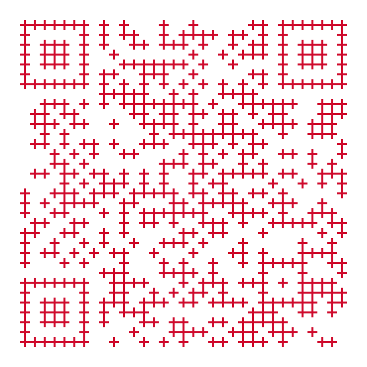

# Who are we?

##

:::::: columns
::: column
{.img_right .portrait}

- Engineering Team Lead
- Backend Blockchain

{.ledger}
:::
::: column
{.img_right .portrait}

- Senior Staff Software Engineer
- Backend Blockchain

{.ledger}
:::
::::::

# Story time

##

Suppose you find this code in your codebase

```scala {data-id="code" data-line-numbers=""}
case class IBAN(
  countryCode: String,
  checkDigits: String,
  bankCode: String,
  branchCode: String,
  accountNumber: String,
  nationalCheckDigit: String
)
```

## {data-auto-animate=""}

This looks good

```scala {data-id="code" data-line-numbers=""}
val iban = IBAN(
  "FR",
  "14",
  "20041",
  "01005",
  "0500013M026",
  "06"
)
```

## {data-auto-animate=""}

Until you find something like this

```scala {data-id="code" data-line-numbers=""}
val shuffled = IBAN(
  "0500013M026",
  "FR",
  "06",
  "14",
  "20041",
  "01005"
)
```
[🧑‍💻]{style="font-size: 400%;"}

## {data-auto-animate=""}

Until you find something like this

```scala {data-id="code" data-line-numbers=""}
val shuffled = IBAN(
  "0500013M026",
  "FR",
  "06",
  "14",
  "20041",
  "01005"
)
```

## {data-auto-animate=""}

So, you try this

```scala {data-id="code" data-line-numbers=""}
val wtf = IBAN(
  "🇫🇷",
  "✅",
  "🏦",
  "🌳",
  "🧾",
  "🤡"
)
```

## {data-auto-animate=""}

So, you try this

```scala {data-id="code" data-line-numbers=""}
val wtf = IBAN(
  "🇫🇷",
  "✅",
  "🏦",
  "🌳",
  "🧾",
  "🤡"
)
```

# How can we do better?

## Maybe with Type aliases?

##

```scala {data-id="code" data-line-numbers=""}
type CountryCode = String
type CheckDigits = String
type BankCode = String
type BranchCode = String
type AccountNumber = String
type NationalCheckDigit = String

case class IBAN(
  countryCode: CountryCode,
  checkDigits: CheckDigits,
  bankCode: BankCode,
  branchCode: BranchCode,
  accountNumber: AccountNumber,
  nationalCheckDigit: NationalCheckDigit
)
```
::: notes

Pros

- Legibility

Cons

- Substitutions are possible
- No validation


:::

## So, maybe with value classes?

##

```scala   {data-id="code" data-line-numbers=""}
case class CountryCode(value: String) extends AnyVal

case class CheckDigits(value: String) extends AnyVal

case class BankCode(value: String) extends AnyVal

case class BranchCode(value: String) extends AnyVal

case class AccountNumber(value: String) extends AnyVal

case class NationalCheckDigit(value: String) extends AnyVal
```

## {data-auto-animate=""}

This looks good

```scala {data-id="code" data-line-numbers=""}
val iban = IBAN(
  CountryCode("FR"),
  CheckDigits("14"),
  BankCode("20041"),
  BranchCode("01005"),
  AccountNumber("0500013M026"),
  NationalCheckDigit("06")
)
```

## {data-auto-animate=""}

And this cannot compile anymore

```scala {data-id="code" data-line-numbers=""}
val shuffled = IBAN(
  AccountNumber("0500013M026"),
  CountryCode("FR"),
  NationalCheckDigit("06"),
  CheckDigits("14"),
  BankCode("20041"),
  BranchCode("01005")
)
```

## {data-auto-animate=""}

But this one still compiles

```scala {data-id="code" data-line-numbers=""}
val wtf = IBAN(
  CountryCode("🇫🇷"),
  CheckDigits("✅"),
  BankCode("🏦"),
  BranchCode("🌳"),
  AccountNumber("🧾"),
  NationalCheckDigit("🤡")
)
```

## Let's add validation

##
```scala
case class CountryCode(value: String) extends AnyVal:
  require(value.length == 2, "Country code must be 2 characters")

case class CheckDigits(value: String) extends AnyVal:
  require(value.length == 2, "Check digits must be 2 characters")

case class BankCode(value: String) extends AnyVal:
  require(value.length == 5, "Bank code must be 5 characters")

case class BranchCode(value: String) extends AnyVal:
  require(value.length == 5, "Branch code must be 5 characters")

case class AccountNumber(value: String) extends AnyVal:
  require(value.length == 11, "Account number must be 11 characters")

case class NationalCheckDigit(value: String) extends AnyVal:
  require(value.length == 2, "National check digit must be 2 characters")
```

## Let's validate without crashing

##
```scala
case class FormatError(reason: String) 
   extends Exception(reason), NoStackTrace
```
##
```scala {data-id="either-code" data-line-numbers=""}
case class CountryCode(value: String) extends AnyVal
object CountryCode:
  def parse(input: String): Either[FormatError, CountryCode] =
    Either.cond(input.length == 2, CountryCode(input), 
      FormatError("Country code must be 2 characters"))

case class CheckDigits(value: String) extends AnyVal
object CheckDigits:
  def parse(input: String): Either[FormatError, CheckDigits] =
    Either.cond(input.length == 2, CheckDigits(input), 
      FormatError("Check digits must be 2 characters"))

case class BankCode(value: String) extends AnyVal
object BankCode:
  def parse(input: String): Either[FormatError, BankCode] =
    Either.cond(input.length == 5, BankCode(input),
      FormatError("Bank code must be 5 characters"))
```

##
```scala {data-id="either-code" data-line-numbers="3,9,15|4-5,10-11,16-17"}
case class CountryCode(value: String) extends AnyVal
object CountryCode:
  def parse(input: String): Either[FormatError, CountryCode] =
    Either.cond(input.length == 2, CountryCode(input), 
      FormatError("Country code must be 2 characters"))

case class CheckDigits(value: String) extends AnyVal
object CheckDigits:
  def parse(input: String): Either[FormatError, CheckDigits] =
    Either.cond(input.length == 2, CheckDigits(input), 
      FormatError("Check digits must be 2 characters"))

case class BankCode(value: String) extends AnyVal
object BankCode:
  def parse(input: String): Either[FormatError, BankCode] =
    Either.cond(input.length == 5, BankCode(input),
      FormatError("Bank code must be 5 characters"))
```

##
```scala {data-id="either-code" data-line-numbers=""}
case class BranchCode(value: String) extends AnyVal
object BranchCode:
  def parse(input: String): Either[FormatError, BranchCode] =
    Either.cond(input.length == 5, BranchCode(input), 
      FormatError("Branch code must be 5 characters"))

case class AccountNumber(value: String) extends AnyVal
object AccountNumber:
  def parse(input: String): Either[FormatError, AccountNumber] =
    Either.cond(input.length == 11, AccountNumber(input), 
      FormatError("Account number must be 11 characters"))

case class NationalCheckDigit(value: String) extends AnyVal
object NationalCheckDigits:
  def parse(input: String): Either[FormatError, NationalCheckDigits] =
    Either.cond(input.length == 2, NationalCheckDigits(input), 
      FormatError("Notional check digits must be 2 characters"))
```

##
```scala {data-id="either-code" data-line-numbers="3,9,15|4-5,10-11,16-17"}
case class BranchCode(value: String) extends AnyVal
object BranchCode:
  def parse(input: String): Either[FormatError, BranchCode] =
    Either.cond(input.length == 5, BranchCode(input), 
      FormatError("Branch code must be 5 characters"))

case class AccountNumber(value: String) extends AnyVal
object AccountNumber:
  def parse(input: String): Either[FormatError, AccountNumber] =
    Either.cond(input.length == 11, AccountNumber(input), 
      FormatError("Account number must be 11 characters"))

case class NationalCheckDigit(value: String) extends AnyVal
object NationalCheckDigits:
  def parse(input: String): Either[FormatError, NationalCheckDigits] =
    Either.cond(input.length == 2, NationalCheckDigits(input), 
      FormatError("Notional check digits must be 2 characters"))
```

##
```scala {data-id="opaque-types-code" data-line-numbers=""}
opaque type BranchCode <: String = String
object BranchCode:

  inline def wrap(input: String): BranchCode = input

  extension (value: BranchCode) inline def unwrap: String = value

  def parse(input: String): Either[FormatError, BranchCode] =
    Either.cond(input.length == 5, wrap(input), 
      FormatError("Branch code must be 5 characters"))
```

## Summary
|               | Legible | Ordered | Valid | Pure  | Performance | Concise |
| :-----------: | :-----: | :-----: | :---: | :---: | :---------: | :-----: |
|  Raw Classes  |    ❌    |    ❌    |   ❌   |   ❌   |      ❌      |    ❌    |
| Type Aliases  |    ✅    |    ❌    |   ❌   |   ❌   |      ❌      |    ❌    |
| Value Classes |    ✅    |    ✅    |   ❌   |   ❌   |      ❌      |    ❌    |
| VC + Require  |    ✅    |    ✅    |   ✅   |   ❌   |      ❌      |    ❌    |
|  VC + Either  |    ✅    |    ✅    |   ✅   |   ✅   |      ❌      |    ❌    |
| Opaque types  |    ✅    |    ✅    |   ✅   |   ✅   |      ✅      |    ❌    |

# Something smarter and with less boilerplate?

# 


## What is Iron? {data-auto-animate=""}

## What is Iron? {data-auto-animate=""}

Composable type constraint library

Created in Scala 3 []{.devicon-scala-plain .colored} by Raphaël Fromentin

It enables binding constraints to a specific type

## What is Iron? {data-auto-animate=""}

Composable type **constraint** library

```scala {data-id="code" data-line-numbers="1|3-7"}
final class Positive

import io.github.iltotore.iron.*

given Constraint[Int, Positive] with
  override inline def test(value: Int): Boolean = value > 0
  override inline def message: String = "Should be strictly positive"


//
```

::: {.faded}
Created in Scala 3 []{.devicon-scala-plain .colored} by Raphaël Fromentin

It enables binding constraints to a specific type
:::

## What is Iron? {data-auto-animate=""}

Composable **type constraint** library

```scala {data-id="code" data-line-numbers="9"}
final class Positive

import io.github.iltotore.iron.*

given Constraint[Int, Positive] with
  override inline def test(value: Int): Boolean = value > 0
  override inline def message: String = "Should be strictly positive"

val x: Int :| Positive = 1


//
```

::: {.faded}
Created in Scala 3 []{.devicon-scala-plain .colored} by Raphaël Fromentin

It enables binding constraints to a specific type
:::

## What is Iron? {data-auto-animate=""}

Composable **type constraint** library

```scala {data-id="code" data-line-numbers="10-11"}
final class Positive

import io.github.iltotore.iron.*

given Constraint[Int, Positive] with
  override inline def test(value: Int): Boolean = value > 0
  override inline def message: String = "Should be strictly positive"

val x: Int :| Positive = 1
//Compile-time error: Should be strictly positive
val y: Int :| Positive = -1 
//
```

::: {.faded}
Created in Scala 3 []{.devicon-scala-plain .colored} by Raphaël Fromentin

It enables binding constraints to a specific type
:::

## What is Iron? {data-auto-animate=""}

**Composable type constraint** library

```scala {data-id="code" data-line-numbers="7"}
final class Positive
// ...
val x: Int :| Positive = 1
//Compile-time error: Should be strictly positive
val y: Int :| Positive = -1 

val foo: Int :| (Positive & Less[42]) = 1


//
```

::: {.faded}
Created in Scala 3 []{.devicon-scala-plain .colored} by Raphaël Fromentin

It enables binding constraints to a specific type
:::

## What is Iron? {data-auto-animate=""}

**Composable type constraint** library

```scala {data-id="code" data-line-numbers="8-9"}
final class Positive
// ...
val x: Int :| Positive = 1
//Compile-time error: Should be strictly positive
val y: Int :| Positive = -1 

val foo: Int :| (Positive & Less[42]) = 1
//Compile-time error: Should be strictly positive
val bar: Int :| (Positive & Less[42]) = -1 


//
```

::: {.faded}
Created in Scala 3 []{.devicon-scala-plain .colored} by Raphaël Fromentin

It enables binding constraints to a specific type
:::


## What is Iron? {data-auto-animate=""}

**Composable type constraint** library

```scala {data-id="code" data-line-numbers="10-11"}
final class Positive
// ...
val x: Int :| Positive = 1
//Compile-time error: Should be strictly positive
val y: Int :| Positive = -1 

val foo: Int :| (Positive & Less[42]) = 1
//Compile-time error: Should be strictly positive
val bar: Int :| (Positive & Less[42]) = -1 
//Compile-time error: Should be less than 42
val baz: Int :| (Positive & Less[42]) = 123
//
```

::: {.faded}
Created in Scala 3 []{.devicon-scala-plain .colored} by Raphaël Fromentin

It enables binding constraints to a specific type
:::

## Validation {data-auto-animate=""}

## Validation {data-auto-animate=""}

```scala {data-id="code" data-line-numbers=""}
val value: Int = ???
val x: Int :| Greater[0] = value
```

## Validation {data-auto-animate=""}

```scala {data-id="code" data-line-numbers=""}
inline val value = 2
val x: Int :| Greater[0] = value
```

## What if the value is known at runtime? {data-auto-animate=""}

```scala {data-id="code" data-line-numbers=""}
val value = ???
val x: Int :| Greater[0] = value.refine
```

::: notes
Imperative

Illegal argument exception
:::

## What if the value is known at runtime? {data-auto-animate=""}

```scala {data-id="code" data-line-numbers=""}
def createIBAN(  countryCode: String,
  checkDigits: String,
  bankCode: String,
  branchCode: String,
  accountNumber: String,
  nationalCheckDigit: String
): Either[String, User] =
  for
    ctr <- countryCode.refineEither[Alphanumeric & Length[Equals[ 2]]]
    chk <- countryCode.refineEither[Alphanumeric & Length[Equals[ 2]]]
    ban <- countryCode.refineEither[Alphanumeric & Length[Equals[ 5]]]
    bra <- countryCode.refineEither[Alphanumeric & Length[Equals[ 5]]]
    acc <- countryCode.refineEither[Alphanumeric & Length[Equals[11]]]
    nck <- countryCode.refineEither[Alphanumeric & Length[Equals[ 2]]]
  yield IBAN(ctr, chk, ban, bra, acc, nck)
```

::: notes

Functional

:::

## Constrained Opaque Types

No implementation leak

```scala
opaque type Positive <: Int  = Int :| Greater[0]

object Positive extends RefinedTypeOps[Int, Greater[0], Positive]
```

## Constrained Opaque Types

Constraint factorization 

```scala  
private type SatsConstraint = 
  GreaterEqual[0] & LessEqual[100000000 * 21000000]

opaque type Sats <: Long = Long :| SatsConstraint

object Sats extends RefinedTypeOps[Long, SatsConstraint, Sats]
```

## Feedback loop {data-auto-animate=""}

How much time do we need to find a bug?

## Feedback loop {data-auto-animate=""}

:::: {.r-stack}
::: {data-id="box1" .circle style="background: #ca3c66; width: 700px; height: 700px;"}
:::
::::

In production

## Feedback loop {data-auto-animate=""}

:::: {.r-stack}
::: {data-id="box1" .circle style="border: 4px dotted #ca3c66; background: transparent; width: 700px; height: 700px;"}
:::
::: {data-id="box2" .circle style="background: #db6a8f; width: 600px; height: 600px;"}
:::
::::

In staging

## Feedback loop {data-auto-animate=""}

:::: {.r-stack}
::: {data-id="box1" .circle .faded style="border: 4px dotted #ca3c66; background: transparent; width: 700px; height: 700px;"}
:::
::: {data-id="box2" .circle .faded style="border: 4px dotted #db6a8f; background: transparent; width: 600px; height: 600px;"}
:::
::: {data-id="box3" .circle style="background: #e8aabe; width: 300px; height: 300px;"}
:::
::::

Integration tests

## Feedback loop {data-auto-animate=""}

:::: {.r-stack}
::: {data-id="box1" .circle .faded style="border: 4px dotted #ca3c66; background: transparent; width: 700px; height: 700px;"}
:::
::: {data-id="box2" .circle .faded style="border: 4px dotted #db6a8f; background: transparent; width: 600px; height: 600px;"}
:::
::: {data-id="box3" .circle .faded style="border: 4px dotted #e8aabe; background: transparent; width: 300px; height: 300px;"}
:::
::: {data-id="box4" .circle style="background: #a7e0e0; width: 200px; height: 200px;"}
:::
::::

Unit tests

## Feedback loop {data-auto-animate=""}

:::: {.r-stack}
::: {data-id="box1" .circle style="border: 4px dotted #ca3c66; background: transparent; width: 700px; height: 700px;"}
:::
::: {data-id="box2" .circle style="border: 4px dotted #db6a8f; background: transparent; width: 600px; height: 600px;"}
:::
::: {data-id="box3" .circle style="border: 4px dotted #e8aabe; background: transparent; width: 300px; height: 300px;"}
:::
::: {data-id="box4" .circle style="border: 4px dotted #a7e0e0; background: transparent; width: 200px; height: 200px;"}
:::
::: {data-id="box5" .circle style="background: #4aa3a2; width: 50px; height: 50px;"}
:::
::::

Compilation time

## Summary

|               | Legible | Ordered | Valid | Pure  | Performance | Concise | Compiles |
| :-----------: | :-----: | :-----: | :---: | :---: | :---------: | :-----: | :------: |
|  Raw Classes  |    ❌    |    ❌    |   ❌   |   ❌   |      ❌      |    ❌    |    ❌     |
| Type Aliases  |    ✅    |    ❌    |   ❌   |   ❌   |      ❌      |    ❌    |    ❌     |
| Value Classes |    ✅    |    ✅    |   ❌   |   ❌   |      ❌      |    ❌    |    ❌     |
| VC + Require  |    ✅    |    ✅    |   ✅   |   ❌   |      ❌      |    ❌    |    ❌     |
|  VC + Either  |    ✅    |    ✅    |   ✅   |   ✅   |      ❌      |    ❌    |    ❌     |
| Opaque types  |    ✅    |    ✅    |   ✅   |   ✅   |      ✅      |    ❌    |    ❌     |
|   **Iron**    |    ✅    |    ✅    |   ✅   |   ✅   |      ✅      |    ✅    |    ✅     |


# Iron {.logo} Ecosystem

## Refinement outputs

- Cats (`Validated`, `Either` + `Parallel[F]`)
- ZIO (`Validation`)

## Typeclasses instances 

- *Tapir*
- JSON (*Circe*, *Jsoniter*, *ZIO-JSON*)
- Databases (*doobie*, *skunk*)
- *Ciris*
- *Scalacheck*

## Integration Exemples

```scala
final case class Tag(name: Tag.Name, value: Tag.Value)

object Tag:

  private type NameConstraint = Not[Empty] & MaxLength[128]
  opaque type Name <: String  = String :| NameConstraint

  object Name extends RefinedTypeOps[String, NameConstraint, Name]

  private type ValueConstraint = Not[Empty] & MaxLength[512]
  opaque type Value <: String  = String :| ValueConstraint

  object Value extends RefinedTypeOps[String, ValueConstraint, Value]
```

## Integration Exemples : Tapir
```scala
val getLatest = base
  .name("Get latest account addresses")
  .in(query[Option[Tag]]("tag"))
  .get
  .in("latest")
  .out(jsonBody[Option[AddressView]])
```

## Integration Exemples : Doobie
```scala
def getLatestByTag(account: AccountId, name: Tag.Name, value: Tag.Value): ConnectionIO[Option[Position]] =
  sql"""
  select
    account_id,
    address,
    coalesce(
      (select jsonb_object_agg(tag_name, tag_value order by tag_name) 
       from position_tags pt where p.position_id = pt.position_id),
      '{}'::jsonb),
    sync_status
  from positions p left join position_tags pt using (position_id)
  where account_id = $account
    and tag_name   = $name
    and tag_value  = $value
  order by position_id desc limit 1
  """.query[Position].option
```

## Making an integration : Doobie

```scala
  inline given [A, C]
    (using inline meta: Meta[A])
    (using Constraint[A, C], Show[A]): Meta[A :| C] =
      meta.tiemap[A :| C](_.refineEither)(identity)

  inline given [T]
    (using m: RefinedTypeOps.Mirror[T], ev: Meta[m.IronType]): Meta[T] =
      ev.asInstanceOf[Meta[T]]
```

# Takeaways

> Making illegal states unrepresentable

[Yaron Minsky](https://blog.janestreet.com/effective-ml-revisited/)

# Takeaways

Scala 3 type system is incredibly powerful

# Takeaways
Noticeably increased the reliability of our code

# Thank you!

{.r-stretch}
